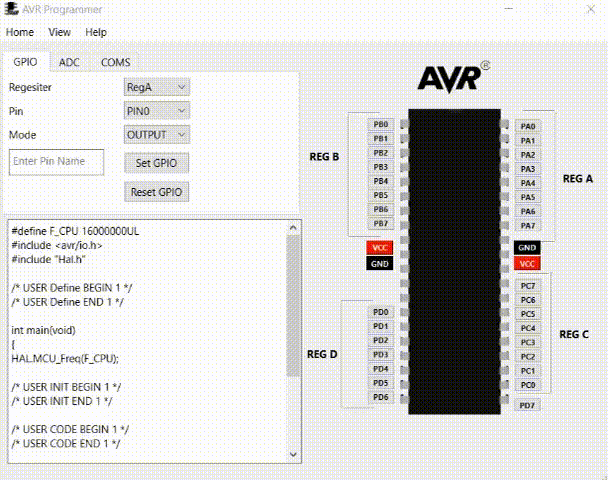

# AvR_Programmer - Unleash Atmega's Power!

**A versatile and user-friendly toolkit for coding Atmega microcontrollers.**

Simplify GPIO configuration, set up ADC for analog input, and enable UART, SPI, and I2C modules effortlessly. 

Future plans include support for timers, servo motors, and LCD.

Ideal for developers, students, and hobbyists.
## Open Source

AvR_Programmer is an open-source project, and we welcome contributions from the community. 
Whether you want to report a bug, suggest a new feature, or submit a pull request, your participation is highly appreciated.
We believe in the power of collaboration and look forward to building an amazing community around AvR_Programmer.

## How to add HAL files and foldet to atmel studio project
https://microchip.my.site.com/s/article/Add-multiple-files-and-folders-to-existing-project-in-Atmel-Studio6#:~:text=How%20to%20add%20multiple%20files,as%20shown%20in%20the%20snapshot

##  Setting GPIOs

**How to set GPIO pin input/output and/or give them name**

##  Dependencies
python 3.11.4 

PySide6
